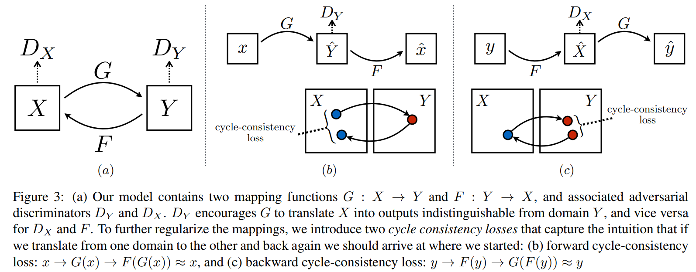
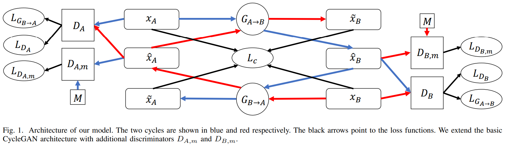
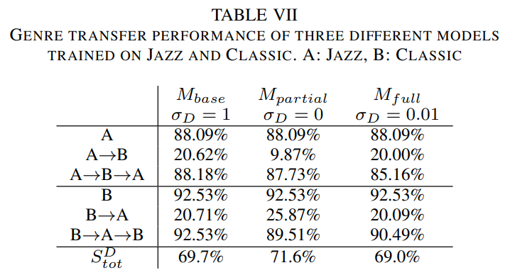
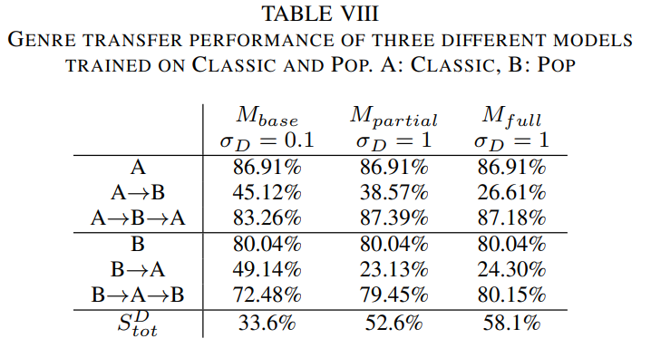
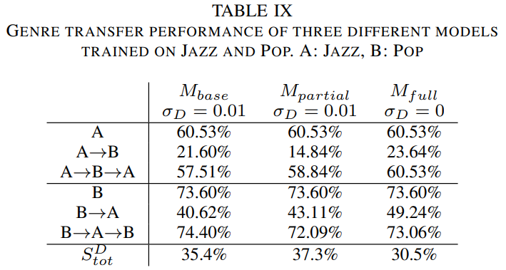

# Symbolic Music Genre Transfer with CycleGAN

2018 IEEE 30th International Conference on Tools with Artificial Intelligence (CCF-C)

ETH Zürich

## 1. 问题背景

音乐风格迁移或音乐领域迁移具有许多可能的现实世界应用，例如，专业音乐人经常创作改编的歌曲，即需要对来自另一位音乐人的歌曲进行新的创作。如果两个音乐人的风格大致属于同一类型，那么乐器的轻微变化加上艺术家的声音的独特特征已经足以让改编歌曲值得一听。然而，原创和改编艺术家常常有完全不同的风格。在这种情况下，改编歌曲的转换过程要复杂得多。根据一首相对简单的摇滚歌曲改编一整部交响乐需要付出很多的努力。风格迁移可以显著加速这一过程，通过自动化的方式进行音乐的大规模创作。

## 2. 基于 CycleGAN 的音乐风格迁移

使用神经网络的风格迁移已经在许多领域展现出了良好的表现。大多数先前的工作都集中在图像领域，例如，拍摄照片并将它们渲染成特定画家的风格，或者将夏季拍摄的图像更改为冬季拍摄的图像。为了使风格迁移起作用，神经网络模型必须对底层域有“深入”的理解。这需要从复杂数据（如图像，自然语言或音乐）中提取显着特征。像变分自动编码器（VAE）和生成性对抗网络（GAN）这样的深度生成模型非常适合这项任务，因为它们试图学习真正的基础数据生成分布。

音乐风格迁移考虑将一段音乐从一个源类型转移到一个目标类型。迁移应该明显，同时保留足够的原始旋律和结构，使得源片仍然可识别。为此，此研究改编 CycleGAN 的图像神经域转移架构，使得得到的模型能在在符号音乐上进行流派转移。此模型可以通过仅改变音符音高来使复调音乐片段从源类型转换为目标类型，例如从爵士音乐到古典音乐。

### 2.1. CycleGAN

在此研究任务中，一次只需处理两个域之间的转换，因此将它们称为域 A 和域 B，其中两个域对应于来自两个不同类型的音乐。由于迁移应该是对称的，即我们想要将样本从 A 迁移到 B，反之也想要从 B 迁移到 A，考虑到这个特点，设计的模型可以遵循 CycleGAN 结构。

​CycleGAN 本质上是两个镜像对称的 GAN，构成了一个环形网络。两个 GAN 共享两个生成器（$X$、$Y$），并各自带一个判别器（$D_X$、$D_Y$），即共有两个判别器和两个生成器。生成器试图从噪声中生成真实的数据，而判别器试图将生成器的输出与真实数据区分开来。训练一个单向 GAN 包含两个 loss，包含将生成数据的分布与目标域中的数据分布相匹配的对抗性损失以及防止所学映射 $G$ 和 $F$ 相互矛盾的循环一致性损失。训练这样两个 GAN 即共四个 loss。​ 本论文使用 CNN 卷积神经网络搭建 GAN 的生成器和判别器。



### 2.2. CycleGAN for Music Genre Transfer

#### 2.2.1. 模型结构设计

在引入了 CycleGAN 以后，实现音乐风格迁移主要存在两个困难需要进行解决。

第一，GAN 的训练是高度不稳定的，生成器和判别器的训练需要仔细平衡。一种常见的问题是判别器太强大，在训练早期就超过了生成器，导致收敛到一个局部最优值。为了稳定 GAN 训练，已经引入了许多技术，其中此研究使用了 InstanceNorm 和 LeakyReLU 激活。

第二，由于生成器实现从源音乐到目标音乐类型的转换，它实际上只需要学习两种类型的特征，因此判别器就可能被欺骗。因为音乐类型可能有一些非常独特的模式，而生成器也可以简单地生成这样的模式来欺骗判别器，使输出的音乐听上去不真实。为了迫使生成器学习更好的高级特征，此研究添加了两个额外的判别器，与标准鉴别器的主要区别在于，它们被训练为区分假数据和来自多个域的数据，而不仅仅是来自目标域的数据，起到了正则化的作用。这些判别器通过鼓励生成器保留输入的结构来改善生成的音乐，同时仍然执行强风格迁移。



CycleGAN for Music Genre Transfer 模型结构

1. 蓝线：从源域 A 到目标域 B 再到源域 A 的转换
2. 红线：从目标域 B 到源域 A 再到目标域 B 的转换
3. 黑线：指向损失函数
4. $G_{A \rightarrow B}$，$G_{B \rightarrow A}$：在两个域之间转换的生成器
5. $D_A$，$D_B$：两个域的判别器
6. $D_{A,m}$，$D_{B,m}$：两个额外的判别器，其迫使生成器学习更多的高级特征
7. $x_A$，$x_B$：来自源域 A 和目标域 B 中的真实样本数据，同时也是网络的输入
8. $\hat{x}_A$：转换到目标域 A 的样本数据，$\tilde{x}_A=G_{B \rightarrow A}(x_B)$
9. $\tilde{x}_A$：转换回源域 A 的样本数据，$\tilde{x}_A=G_{B \rightarrow A}(\hat{x}_B)=G_{B \rightarrow A}(G_{A \rightarrow B}(x_A))$
10. $M$：一个包含多个域的音乐集

#### 2.2.2. 损失函数

**生成器损失**

$$
L_{G}=L_{G_{A\rightarrow B}}+L_{G_{B\rightarrow A}}+\lambda L_{c}
$$

其分为两个部分：对抗损失和循环一致损失，$\lambda$ 表示循环一致损失的权重，论文中设为 10

- 对抗损失
  $$
  \begin{aligned}
  L_{G_{A\rightarrow B}} =\left\| D_{B}\left( \hat{x}_{B} \right) -1\right\|_{2} \\
  L_{G_{B\rightarrow A}}=\left\| D_{A}\left( \hat{x}_{A} \right) -1\right\|_{2}
  \end{aligned}
  $$
  对于生成器，我们希望其生成的数据都被判定为真，从而欺骗判别器，因此这里减去 1，1 即代表着标签为真
- 循环一致损失
  $$
  L_{c} = \left\|  \tilde{x}_{A} - x_{A}\right\|_{1} + \left\|  \tilde{x}_{B} - x_{B}\right\|_{1}
  $$
  循环一致损失保证了输入经过两个生成器之后，即完成了一次循环，最终能被映射回自身
  如果取消循环一致损失，输入与输出之间的关系将大大减弱
  同时，循环一致损失也可以看做一个正则化项，它保证了生成器不忽略输入的数据，而是保留更多必要信息，以完成反向转换

**判别器损失**

$$
L_{D, all}=L_{D}+\gamma \left(  L_{D_{A, m}}+L_{D_{B, m}}\right)
$$

分为标准判别器损失和两个额外判别器损失，$\gamma$ 是额外判别器损失的权重，论文中设为 1

标准判别器损失

$$
\begin{aligned}
L_{D_{A}} = \frac{1}{2} \left(\left\| D_{A} \left( x_{A} \right) -1 \right\|_{2} + \left\| D_{A} \left( \hat{x}_{A} \right)\right\|_{2} \right) \\
L_{D_{B}} = \frac{1}{2} \left(\left\| D_{B} \left( x_{B} \right) -1 \right\|_{2} + \left\| D_{B} \left( \hat{x}_{B} \right)\right\|_{2} \right)
\end{aligned}
$$

$\left\| D_{A} \left( x_{A} \right) -1 \right\|_{2}$ 就是对源样本的判别损失，$\left\| D_{A} \left( \hat{x}_{A} \right)\right\|_{2}$ 是对生成对抗样本的判别损失，其实是 $\left\| D_{A} \left( \hat{x}_{A} \right) -0 \right\|_{2}$

额外判别器损失

$$
\begin{aligned}
L_{D_{A, m}} = \frac{1}{2} \left(\left\| D_{A, m} \left( x_{M} \right) -1 \right\|_{2} + \left\| D_{A, m} \left( \hat{x}_{A} \right)\right\|_{2} \right) \\
L_{D_{B, m}} = \frac{1}{2} \left(\left\| D_{B, m} \left( x_{M} \right) -1 \right\|_{2} + \left\| D_{B, m} \left( \hat{x}_{B} \right)\right\|_{2} \right)
\end{aligned}
$$

### 2.3. 评价

​ 音乐风格迁移效果的评价方式是构建了一个二元分类器，输出风格 A 和风格 B 的分类概率分布。最终结果表明这个模型的音乐风格迁移效果较为显著，并且转换后可以实际听到音乐风格的转变，虽然音乐结构复杂但是听起来一般都比较和谐。


|   JAZZ CLASSIC    |    CLASSIC POP    |     JAZZ POP      |
| :---------------: | :---------------: | :---------------: |
|  |  |  |

## 3. 代码实现

### 3.1. 资源

论文作者给出了 TensorFlow 和 TensorFlow 2 上的实现，[sumuzhao/CycleGAN-Music-Style-Transfer](https://github.com/sumuzhao/CycleGAN-Music-Style-Transfer) 和 [sumuzhao/CycleGAN-Music-Style-Transfer-Refactorization](https://github.com/sumuzhao/CycleGAN-Music-Style-Transfer-Refactorization)

**我们参考 Pytorch 版 CycleGAN [junyanz/pytorch-CycleGAN-and-pix2pix](https://github.com/junyanz/pytorch-CycleGAN-and-pix2pix)，将论文代码迁移到了 PyTorch 1.10 版本**

### 数据形式

文中使用的音乐数据为 MIDI 文件，并按照文中的数据预处理方式，主要是舍弃具有音轨或声音较多的 MIDI 文件（如交响乐等），然后舍弃鼓的音轨，之后将所有的音轨上的音符合并在一个音轨上。然后将通过上述方式筛选后的 MIDI 文件处理成 `[batch_size, 64, 84, 1]`，然后将该矩阵用于模型训练。其中，`64` 指的是对连续的 4 个小节（bar）分别进行 16 timesteps 的采样。`84` 是指音高（pitch）范围，由于 MIDI 文件的音高范围为 0-127，但 C1 以下的音符和 C8 以上的音符很少，故舍弃，剩余音符的音高范围只有 84 个。`1` 是将每个音符的音量（velocity）二值化为 0 或 1。

### 3.2. 网络结构定义（PyTorch 复现）

与众多的 GAN 一样，CycleGAN 包含 Generator 和 Discriminator

Generator 定义如下，包含一个 3 层卷积的 encoder，10 层 ResNet，和 3 层卷积的 decoder


```py
class Generator(nn.Module):
    def __init__(self, dim=64):
        super(Generator, self).__init__()

        self.encoder = nn.Sequential(
            nn.Conv2d(in_channels=1,
                      out_channels=dim,
                      kernel_size=7,
                      stride=1,
                      bias=False),
            nn.InstanceNorm2d(num_features=dim),
            nn.ReLU(inplace=True),
            # (bs,64,64,84)

            nn.Conv2d(in_channels=dim,
                      out_channels=2 * dim,
                      kernel_size=3,
                      stride=2,
                      padding=1,
                      bias=False),
            nn.InstanceNorm2d(num_features=2 * dim),
            nn.ReLU(inplace=True),
            # (bs,128,32,42)

            nn.Conv2d(in_channels=2 * dim,
                      out_channels=4 * dim,
                      kernel_size=3,
                      stride=2,
                      padding=1,
                      bias=False),
            nn.InstanceNorm2d(num_features=4 * dim),
            nn.ReLU(inplace=True)
            # (bs,256,16,21)
        )

        self.ResNet = nn.Sequential(
            *[ResNetBlock(dim=4 * dim,
                          kernel_size=3,
                          stride=1) for _ in range(10)]
        )

        self.decoder = nn.Sequential(
            nn.ConvTranspose2d(in_channels=4 * dim,
                               out_channels=2 * dim,
                               kernel_size=3,
                               stride=2,
                               padding=1,
                               output_padding=1,
                               bias=False),
            nn.InstanceNorm2d(num_features=2 * dim),
            nn.ReLU(inplace=True),
            # (bs,128,32,42)

            nn.ConvTranspose2d(in_channels=2 * dim,
                               out_channels=dim,
                               kernel_size=3,
                               stride=2,
                               padding=1,
                               output_padding=1,
                               bias=False),
            nn.InstanceNorm2d(dim),
            nn.ReLU(inplace=True)
            # (bs,64,64,84)
        )

        self.output = nn.Conv2d(in_channels=dim,
                                out_channels=1,
                                kernel_size=7,
                                stride=1,
                                bias=False)
        # (bs,1,64,84)

        for i in range(3):
            self.encoder[3 * i].weight = \
                kernel_initializer(self.encoder[3 * i].weight)

        for i in range(2):
            self.decoder[3 * i].weight = \
                kernel_initializer(self.decoder[3 * i].weight)

        self.output.weight = kernel_initializer(self.output.weight)

    def forward(self, x):
        x = padding(x)
        x = self.encoder(x)
        # (bs, 256, 16, 21)
        for i in range(10):
            x = self.ResNet[i](x)
        # (bs,256,16,21)
        x = self.decoder(x)
        x = padding(x)
        x = self.output(x)
        return torch.sigmoid(x)
```

Discriminator 定义如下，为一个 3 层卷积网络


```py
class Discriminator(nn.Module):
    def __init__(self, dim=64):
        super(Discriminator, self).__init__()
        self.discriminator = nn.Sequential(
            nn.Conv2d(in_channels=1,
                      out_channels=dim,
                      kernel_size=7,
                      stride=2,
                      padding=3,
                      bias=False),
            nn.LeakyReLU(negative_slope=0.2, inplace=True),
            # (bs,64,32,42)

            nn.Conv2d(in_channels=dim,
                      out_channels=4 * dim,
                      kernel_size=7,
                      stride=2,
                      padding=3,
                      bias=False),
            nn.InstanceNorm2d(num_features=4 * dim),
            nn.LeakyReLU(negative_slope=0.2, inplace=True),
            # (bs,256,16,21)

            nn.Conv2d(in_channels=4 * dim,
                      out_channels=1,
                      kernel_size=7,
                      stride=1,
                      padding=3,
                      bias=False)
            # (bs,1,16,21)
        )

        for i in [0, 2, 5]:
            self.discriminator[i].weight = kernel_initializer(self.discriminator[i].weight)

    def forward(self, x):
        x = self.discriminator(x)
        return x
```

CycleGAN 定义（主要部分）

```py

class CycleGAN(nn.Module):
    def __init__(self, g_dim=64, d_dim=64, sigma=0.01, sample_size=50, lamb=10,
                 mode='train', lr=2e-3, wd=1e-2, gamma=1, device="cpu"):
        super(CycleGAN, self).__init__()
        assert mode in ['train', 'A2B', 'B2A']

        self.G_A2B = Generator(g_dim)
        self.G_B2A = Generator(g_dim)
        self.D_A = Discriminator(d_dim)
        self.D_B = Discriminator(d_dim)
        self.D_A_all = Discriminator(d_dim)
        self.D_B_all = Discriminator(d_dim)
```

CycleGAN 的 forward 和 backward 更新流程。这里需要注意的是

- Generator 需要先 backward，并且**在 Generator backward 时，Discriminator 不计算梯度** `requires_grad=False`
- 在 Discriminator 判别生成对抗样本时，**要将其 `detach`，否则该 tensor 的梯度又会传到 Generator 上**，产生 inplace modification 的错误。该问题在 PyTorch 1.5 版本之前不报错，但实际实现上是错误的
  > RuntimeError: one of the variables needed for gradient computation has been modified by an inplace operation

```py
    # forward
    # blue line
    self.fake_B = self.G_A2B(self.real_A)
    self.cycle_A = self.G_B2A(self.fake_B)

    # red line
    self.fake_A = self.G_B2A(self.real_B)
    self.cycle_B = self.G_A2B(self.fake_A)

    [self.sample_fake_A, self.sample_fake_B] = self.sampler([self.fake_A, self.fake_B])

    self.gauss_noise = torch.ones_like(self.real_A)
    self.gauss_noise = torch.abs(kernel_initializer(self.gauss_noise, mean=0, std=self.sigma))

    # G_A and G_B
    self.set_requires_grad([self.D_A, self.D_B], False)  # Ds require no gradients when optimizing Gs
    self.backward_G()  # calculate gradients for G_A and G_B
    # update G_A and G_B's weights
    self.optimizer_GA2B.step()
    self.optimizer_GB2A.step()

    # D_A and D_B
    self.set_requires_grad([self.D_A, self.D_B], True)
    self.backward_D_A()  # calculate gradients for D_A
    self.backward_D_B()  # calculate graidents for D_B
    # update D_A and D_B's weights
    self.optimizer_DA.step()
    self.optimizer_DB.step()
    self.optimizer_DA_all.step()
    self.optimizer_DB_all.step()
```

其中，Generator 的 loss 计算和 backward

```py
    def backward_G(self):
        # Cycle loss
        self.c_loss = self.lamb * cycle_loss(self.real_A, self.cycle_A, self.real_B, self.cycle_B)

        DA_fake = self.D_A(self.fake_A + self.gauss_noise)
        DB_fake = self.D_B(self.fake_B + self.gauss_noise)

        # Generator losses
        self.G_A2B_loss = self.l2loss(DB_fake, torch.ones_like(DB_fake)) + self.c_loss
        self.G_B2A_loss = self.l2loss(DA_fake, torch.ones_like(DA_fake)) + self.c_loss

        self.G_A2B_loss.backward(retain_graph=True)
        self.G_B2A_loss.backward(retain_graph=True)
```

Discriminator 的 loss 计算和 backward

```py
    def backward_D_basic(self, D, D_all, real, sample_fake, real_mixed):
        # Real
        pred_real = D(real + self.gauss_noise)
        pred_real_all = D_all(real_mixed + self.gauss_noise)
        # Fake
        pred_fake_sample = D(sample_fake.detach() + self.gauss_noise)
        pred_fake_all = D_all(sample_fake.detach() + self.gauss_noise)

        # Discriminator losses
        D_loss_real = self.l2loss(pred_real, torch.ones_like(pred_real))
        D_loss_fake = self.l2loss(pred_fake_sample, torch.zeros_like(pred_fake_sample))
        D_loss = (D_loss_real + D_loss_fake) * 0.5

        D_loss.backward(retain_graph=True)

        # All losses
        D_all_loss_real = self.l2loss(pred_real_all, torch.ones_like(pred_real_all))
        D_all_loss_fake = self.l2loss(pred_fake_all, torch.zeros_like(pred_fake_all))
        D_all_loss = (D_all_loss_real + D_all_loss_fake) * 0.5

        D_all_loss.backward(retain_graph=True)

        return D_loss, D_all_loss

    def backward_D_A(self):
        self.D_A_loss, self.D_A_all_loss = self.backward_D_basic(
            self.D_A, self.D_A_all, self.real_B, self.sample_fake_B, self.real_mixed)

    def backward_D_B(self):
        self.D_B_loss, self.D_B_all_loss = self.backward_D_basic(
            self.D_B, self.D_B_all, self.real_A, self.sample_fake_A, self.real_mixed)
```
